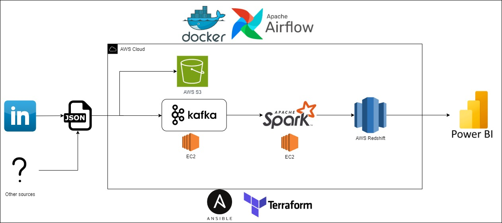
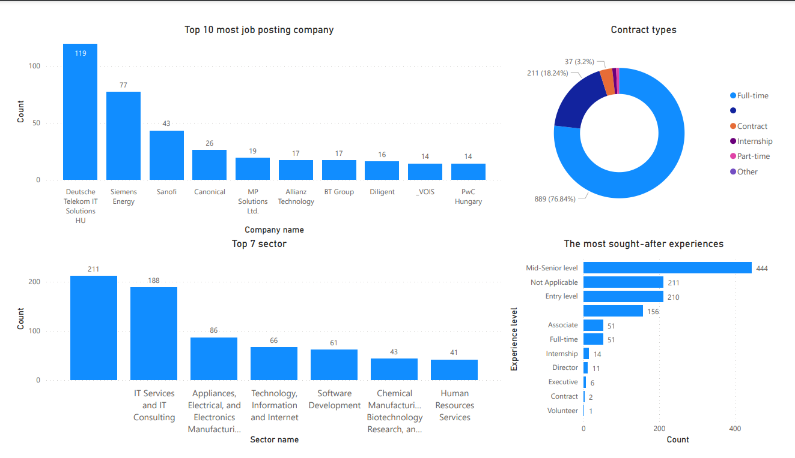
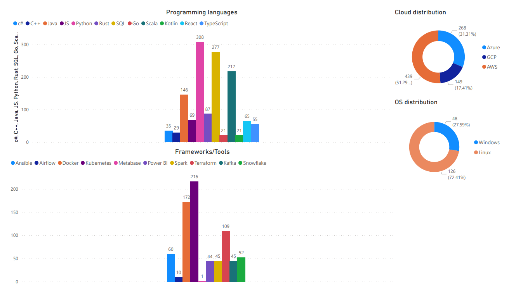

## Motivation
My primary motivation behind this repository is to develop a data pipeline and analyze the processed data to acquire insightful knowledge. Specifically, I am interested in the job market and the skills currently desired in the industry. This will enable me to learn those highly sought-after skill sets. Throughout the process, I utilized the most popular tools and frameworks to the best of my understanding and compared the results to reality.

## Summary



For this project, I used one of the most popular online job posting websites,  LinkedIn. To collect the job postings, I used an already premade API that gives back the data in JSON format. For further development, in case more data sources will be added and large throughput is needed, I used Apache Kafka to collect the data in one place. AWS S3 was used for storing the temporary unprocessed raw data in buckets.

The processing step was done by Apache Spark to divide the runtime to  multiple different workloads, if necessary. The processed data is then stored in a data warehouse, which is an AWS Redshift. For data analysis, Power BI was used to obtain the needed information for the given problem. Detailed results are below. Airflow was used to manage and schedule the workflow from the data source to the data warehouse.

For non-AWS services the deployment can be either on the AWS or local environment. The AWS version uses Terraform for deploying infrastructure as code and Ansible for setting up and configuring the deployed infrastructure. The local version utilizes Docker to containerize Kafka and Spark. GitHub Actions(CI/CD) helped in continuous integration and testing with pytest. It is also possible to implement continuous deployment to the AWS.

*The scraper are filtered to Budapest and each day only the last 24 hours posted jobs are collected.*


## Results 


The first image provides a general overview of the collected job posts, featuring four different charts. The first chart(Top left) shows the top 10 companies based on the number of jobs they posted during the collection period. The second(Top right) is a donut chart displaying the different contract types for the given jobs. It is also visible that 18% of the posts do not have this set, making it harder to filter on the source website. The third(Bottom left) chart shows the top 7 sectors targeted by the postings, with many posts not specifying the sector; in fact, 'not specified' is the most common category. The fourth(Bottom right) chart is an experience distribution, illustrating the demand for each seniority level in the postings.


The second image showcases the truly interesting findings, as the whole purpose of the analysis was to find these out. The data was extracted based on whether the given name of the technology was mentioned in the job description. The first chart displays the most popular programming languages, with Python, SQL, and Scala leading, followed by Java in fourth place. In terms of Frameworks/Tools, Kubernetes was the most popular skill, alongside Docker and Terraform. On the cloud provider front, AWS is in the lead, followed by Microsoft Azure and Google Cloud. Another interesting thing is regarding OS-specific skills, unsurprisingly, Linux is the most sought after, but Windows also has a presence. Notably, MacOS was not present in the dataset.

## Future plans

Here, I present a few possible upgrades to this project:

- [ ]  We can add more data sources if we have access to the required API to retrieve the given data. Since Kafka is used, the process becomes much easier as it only needs to be sent to the same place as the other sources
- [ ] More advanced processing of the data, for example, better Keyword Extraction. This is important because there can be technology names that are written differently, yet they still refer to the same tool. One easier approach is to use LLM, like the ChatGPT
- [ ] Make deployment easier. For instance, utilize a Makefile, generate an Ansible inventory automatically with Terraform, and set up the EC2 instances. Deploy the Spark streaming and possibly deploy Airflow to the cloud as well.


## Requirements

1. Configure AWS account through [AWS CLI](https://aws.amazon.com/cli/). [Reqruired for Terraform]
2. [Terraform](https://www.terraform.io/). [Required to provision AWS services]
3. [Docker / Docker-Compose](https://www.docker.com/). [Required to run pipeline]

## Run the code

Generate infrastructure with terraform:

`terraform -chdir=terraform apply`

If you choose to run Spark and Kafka on EC2, use Ansible for setting up the EC2 instances(tweaks needed):
1. Fill out ansible/inventory
2. Run ansible setup files
```
ansible-playbook ansible/spark_setup.yml -i ansible/inventory
ansible-playbook ansible/kafka_setup.yml -i ansible/inventory
```

Set up local airflow and the pipeline with docker:

`docker-compose up -d`

Run Spark separately:

`python3 spark/spark_process.py`